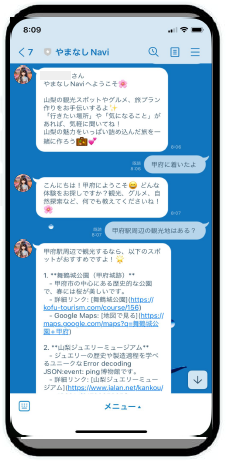

# 観光支援AIエージェントアプリの開発

## 概要

山梨県は観光資源はあるのに、その成長が伸び悩んでいるという課題があった。そこで、この課題を解決するために、山梨観光の魅力を伝える情報提供やユーザの状況に基づいて観光の案内をする「観光支援AIエージェントアプリ」を開発した。結果として、最優秀賞に選ばれるなど高い評価を獲得し、観光客だけでなく地元の人の地域再開拓にも大きく貢献できたと思う。

## 執筆者

- 評価対象者：高野真翔

## 背景

山梨県には豊富な観光資源と首都圏からのアクセス性という希少な地域性がありながらも、「観光客が一般に有名な観光地に偏ってしまう」・「観光の仕方がわからない」という課題があったので、従来の一方的な情報提供ではなく、会話を通してユーザの状況に合わせた情報提供を行うAIエージェントアプリを開発した。

## チーム

このプロジェクトはYAMANASHI AIハッカソン2024で取り組んだものであり、4人チームで開発を行いました。メンバーの背景を反映し役割分担はそれぞれ、「AIモデル・プラットフォーム設定」「バックエンド・フロントエンド開発」「市場アナライズ・データ収集」「モデルテスタ・ナレッジ調整」とし、私は主に「バックエンド・フロントエンド開発」を担当しました。また、各々自分の領域に閉じずにオープンに開発を行った。

## 解決手法

この開発では、ユーザが山梨観光の魅力を手軽に的確に得られるような設計を目指しました。

採用したフレームワーク等は以下の通り

|AIプラットフォーム|バックエンド|フロントエンド|
|----|----|----|
|Dify|Django|Next.js LINE WhatsApp|

フロントエンドにはLINEやWhatsAppといったSNSに寄生することで導入コストを大幅に下げた。今回は開発目的のためLINEのみの実装し留まったが、世界的に普及しているWhatsAppも想定している。

この開発のリポジトリは以下です。
- バックエンド:https://github.com/Integral-07/YamanashiNavi_backend
- フロントエンド:https://github.com/Integral-07/YamanashiNavi_frontend

#### 最終的にできたもの

- 実際のLINE画面 

- 想定してたWhatsApp画面 

- 実際のオリジナルWEB画面 

- 実際のDifyのWEB画面 

このサービスは以下のページからアクセスできます。（AIの使用料がかかるので酷使しないでください...）
- オリジナルフロントエンド：https://yamanashi-navi-frontend.vercel.app/yamanashi_navi
- DifyのデフォルトWEB：https://udify.app/chat/zwQ44xARIMZjUIHg
- LINE版： 

### ポイント１：LLMモデル+ RAG + 検索アクションの採用

#### 課題

LLMモデルのみでは、古い情報が提供されたりローカルな情報が含まれなかったりと観光支援には足りない知識が多かった。

#### 対応と次の課題

LLMモデルにRAGを適用することでローカル情報の補完。しかし、RAGの適時性・正確性の担保のためのKnowledge作成・更新コストが次の課題となった。

#### 対応２

ローカル情報及びLLMモデルの持つ情報の適時性・正確性を向上するため、APIによるリアルタイム検索を組み合わせた。これにより、季節や時間帯による適切な情報提供も可能になった。

### ポイント２：場所の提案にカルーセルを採用

#### 課題

このAIエージェントは基本的にテキストチャットのみ対応しているため、観光地や食事処を提案する際に文字列だけだととてもわかりにくくなってしまう課題があった。

#### 対応と次の課題

これはLINE版に限られてしまうが、LINEのカルーセルというメッセージタイプを採用することで、その場所のイメージや概要・マップへのリンクなどを視覚的に提案することができた。
  
また、任意の個数の場所の情報をカルーセルに適用するためにAIからの回答形式を調整する必要があった。

#### 対応２

Json形式で回答するようAIにプロンプトを渡し、結果を正規表現を用いてJson形式の部分だけ抽出することで、柔軟かつ安定したメッセージを作成できるようになった。

## 今後の展望

- LINEは普及している地域が限られているので、世界的にユーザの多いWhatsApp版のフロントエンドを作成する
- 音声入出力などのマルチモーダル機能の導入
- それぞれのバージョン（LINE, WhatsApp, web）の会話履歴を統合する

## 参考(Qiita記事)
- https://qiita.com/Integral-07/items/be2fdeb59b07168a2c95
